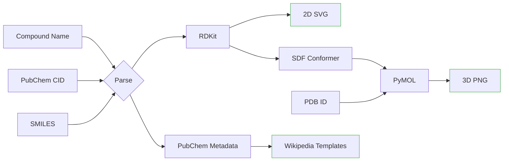

[](LICENSE)
[](https://github.com/Wolren/WikiMolGen/commits)
[](https://github.com/Wolren/WikiMolGen/issues)
[](https://github.com/Wolren/WikiMolGen)
[](pyproject.toml)
[](web/app.py)
[](requirements.txt)

# WikiMolGen

Generate 2D and 3D molecular visualizations from PubChem or SMILES — RDKit and PyMOL-based tool

Originally developed for generating molecular structure images for Wikipedia, WikiMolGen provides a Python API, CLI, and a web interface for creating 2D SVG diagrams and 3D rendered structures.



## Installation

### Basic (2D only)
```
pip install wikimolgen
```

### Full (2D + 3D with PyMOL)
```
conda create -n wikimolgen python=3.10
conda activate wikimolgen
conda install -c conda-forge rdkit pubchempy pymol-open-source
pip install wikimolgen
```

### Development
```
git clone https://github.com/Wolren/wikimolgen.git
cd wikimolgen
pip install -e ".[dev]"
```

## Web Interface

The Streamlit-based web interface provides an interactive dashboard for generating molecular visualizations with full control over rendering, styling, and Wikipedia metadata.

**Features:**
- **3 modes**: 2D (SVG), 3D (ray-traced PNG), and Protein (PDB cartoon)
- **Rich controls**: atom coloring, lighting, transparency, ray tracing, conformer generation
- **Wikipedia tooling**: auto-generated Infobox drug/chembox templates, metadata, and Commons upload links

```
streamlit run web/app.py
```

## CLI

```
wikimolgen 2d --compound aspirin --output aspirin.svg
wikimolgen 3d --compound 5284583 --render --output-base lsd
```

## License
GNU General Public License v3.0 or later - see [LICENSE](LICENSE)