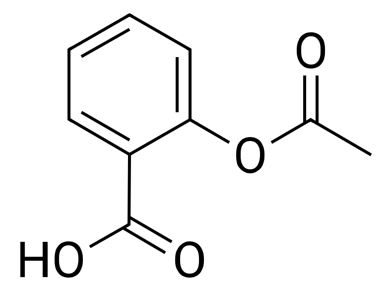
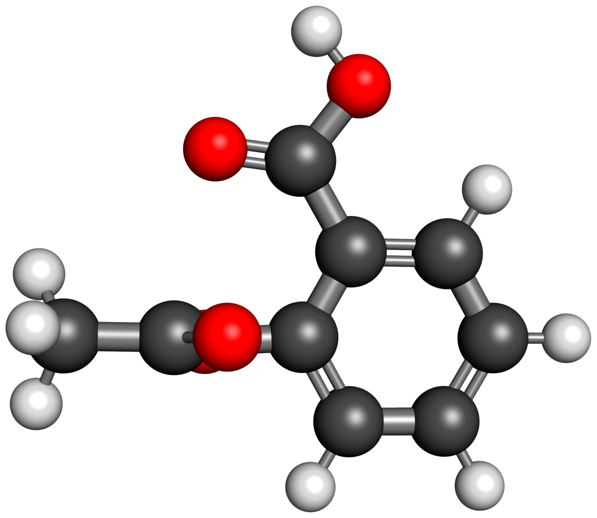
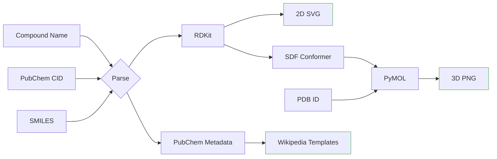

<div align="center">


Generate 2D and 3D molecular visualizations from PubChem or SMILES. RDKit and PyMOL based tool.

Originally developed for generating molecular structure images for Wikipedia, WikiMolGen provides a Python API, CLI, and a web interface for creating 2D SVG diagrams and 3D rendered structures.

[](LICENSE)
[](https://github.com/Wolren/WikiMolGen/commits)
[](https://github.com/Wolren/WikiMolGen/issues)
[](https://github.com/Wolren/WikiMolGen)
[](pyproject.toml)
[](web/app.py)
[](requirements.txt)

</div>

## Examples

| 2D structure (SVG) | 3D render (ray-traced PNG) |
|---|---|
|  |  |

Both images were generated with the tool itself:

```
wikimolgen 2d --compound aspirin --output aspirin.svg
wikimolgen 3d --compound aspirin --render --output-base aspirin
```

## How it works


```mermaid
graph LR
    A["Compound Name"] --> D{Parse}
    B["PubChem CID"] --> D
    C["SMILES"] --> D
    D --> E["RDKit"]
    E --> F["2D SVG"]
    E --> G["SDF Conformer"]
    G --> H["PyMOL"]
    H --> I["3D PNG"]
    J["PDB ID"] --> H
    D --> K["PubChem Metadata"]
    K --> L["Wikipedia Templates"]
    style F stroke:#4caf50
    style I stroke:#4caf50
    style L stroke:#4caf50
```

## Features

- Three generation modes: 2D SVG, 3D ray-traced PNG, and protein cartoons from PDB
- Input as PubChem CID, compound name, or SMILES string
- Wikipedia tooling: Infobox drug/chembox templates, compound metadata, and Commons upload links
- Template and color-template systems for reproducible styling
- Python API, CLI, and Streamlit web interface

---

## Installation

### Basic (2D only)
```
pip install wikimolgen
```

### Full (2D + 3D with PyMOL)
```
conda create -n wikimolgen python=3.10
conda activate wikimolgen
conda install -c conda-forge rdkit pubchempy pymol-open-source
pip install wikimolgen
```

## Web Interface

The Streamlit-based web interface provides an interactive dashboard for generating molecular visualizations with full control over rendering, styling, and Wikipedia metadata.

**Features:**
- **3 modes**: 2D (SVG), 3D (ray-traced PNG), and Protein (PDB cartoon)
- **Rich controls**: atom coloring, lighting, transparency, ray tracing, conformer generation
- **Wikipedia tooling**: auto-generated Infobox drug/chembox templates, metadata, and Commons upload links

---

## CLI

The `wikimolgen` command provides three subcommands: `2d`, `3d`, and `protein`.

### `2d`: generate 2D SVG structures

```
wikimolgen 2d --compound aspirin --output aspirin.svg
wikimolgen 2d --compound 24802108 --template wikipedia_2d --color-template cpk_standard
```

| Flag | Description |
| --- | --- |
| `--compound` | PubChem CID, compound name, or SMILES string (required) |
| `--output` | Output SVG filename (default: `molecule_2d.svg`) |
| `--template` | Settings template (predefined name or JSON file path) |
| `--color-template` | Color template (predefined name or JSON file path) |
| `--angle` | Rotation angle in degrees (default: 180) |
| `--auto-orient` | Automatically optimize viewing angle using PCA |
| `--scale` | Pixels per coordinate unit (default: 30.0) |
| `--use-bw` | Use black and white atom palette |
| `--transparent-bg` | Use transparent background |

### `3d`: generate 3D structures with optional PyMOL rendering

```
wikimolgen 3d --compound 5284583 --render --output-base lsd
wikimolgen 3d --compound aspirin --render --x-rotation 10 --y-rotation 200 --z-rotation 0
```

| Flag | Description |
| --- | --- |
| `--compound` | PubChem CID, compound name, or SMILES string (required) |
| `--output-base` | Base name for output files (default: compound name) |
| `--template` | Settings template (predefined name or JSON file path) |
| `--color-template` | Color template (predefined name or JSON file path) |
| `--render` | Render molecule with PyMOL (generates PNG) |
| `--force-field` | Force field for optimization: `MMFF94` or `UFF` (default: MMFF94) |
| `--ray-trace` | Enable ray tracing mode |
| `--bg-color` | Background color: `white`, `black`, or `gray` (default: white) |
| `--width` / `--height` | Render size in pixels (default: 1800 × 1600) |
| `--x-rotation` / `--y-rotation` / `--z-rotation` | Rotation around each axis in degrees |

### `protein`: render protein structures from PDB

```
wikimolgen protein 8F7W --output 8f7w_protein.png --ray-trace
```

| Flag | Description |
| --- | --- |
| `pdb_id` | PDB identifier, e.g. `8F7W` (positional, required) |
| `--output`, `-o` | Output PNG filename |
| `--color-scheme` | `secondary_structure`, `rainbow`, `chain`, or `hydrophobicity` (default: secondary_structure) |
| `--show-ligand` | Show ligand/heteroatoms (default: on) |
| `--no-ligand` | Hide ligand/heteroatoms |
| `--show-water` | Show water molecules |
| `--width` / `--height` | Image size in pixels (default: 1920 × 1080) |
| `--ray-trace` | Enable ray tracing |

## Tech stack

| Tool | Purpose |
| --- | --- |
| RDKit 2025.3+ | 2D structure generation, SMILES parsing, conformers |
| PyMOL (optional) | 3D rendering and ray tracing |
| Streamlit 1.50+ | Web interface |
| PubChemPy | PubChem compound lookup |
| Biotite | Protein structure parsing (PDB) |
| NumPy / Pillow / Requests | numerics, image post-processing, HTTP |

## Limitations

- 3D rendering requires the optional PyMOL dependency (`pymol-open-source`); the 2D path works without it.
- Compound metadata and PDB fetching need network access to the PubChem and RCSB APIs.
- Predefined templates cover common Wikipedia use cases; unusual molecule classes may need a custom JSON template.

## License

PolyForm Noncommercial 1.0.0 - noncommercial use only. Commercial use and monetary gain require explicit written approval from the author. See [LICENSE](LICENSE).
